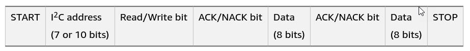

# Inter-Integrated Circuit (I2C)

I2C is a **serial communication protocol** for low-speed devices.

The I2C protocol uses three lines: 
* **Serial Data line (SDA)** for transmitting data
* **Serial Clock line (SCL)** to determine when the data gets read
* **Ground line (GND)**

SDA and SCL lines are connected to the peripherals and they are **open drain drivers**, meaning that both lines need to be connected to resistors.


Voltages vary from **1.8 V, 3.3 V, and 5.0 V**, and transfers can occur at four different speeds: 
* 100 kHz, or the **initial speed according to I2C specifications** 
* 400 kHz, which is the **fast mode** 
* 1 MHz, called **high speed mode**
* 3.2 MHz, called **ultrafast mode**

## Protocol 

I2C uses a **controller-peripheral configuration**:
* The components transfer data over the SDA line, bit by bit, in eight-bit sequences. 
* The controller, or multiple controllers, manages the SCL line. 
* An I2C architecture supports more than one controller and one or more peripherals, 
    each with unique addresses used for communication.



* The controller begins each message with a **START condition** that signals the beginning 
of the message. 
* Then it sends the **peripheral’s address**, which is usually 7 bits long but can be as long as 10 bits. 
    This allows for up to 128 (if using 7-bit addresses) or 1024 peripherals (if using 10-bit addresses) 
    on the same bus. 
* The controller also appends a **Read/Write bit** that indicates the kind of operation to perform. 
* An **ACK/NACK bit** indicates what the following data segment will be. 
* I2C divides the actual **data** into **eight-bit sequences**, each of which ends in another ACK/NACK bit. 
* The controller ends the message by sending the **STOP condition**.


## Hardware Tools 
The **Bus Pirate** firmware has built-in support for I2C. 


_Example_: Use BusPirate to read I2C messages (100KHz)
```
>m
1. HiZ
…
4. I2C
…
(1) >4
Set speed:
1. 50KHz
2. 100KHz
3. 400kHz
(1) >2
I2C READY
I2C>
```

I2C commands:

* **{** or **[**: Issue I2C start condition.
* **]** or **}**: Issue I2C stop condition.
* **r**: Read one byte, send ACK. (r:1…255 for bulk reads)
* **0b**: Write this binary value, check ACK. 
    Format is 0b00000000 for a byte, but partial bytes are also fine: 0b1001.
* **0x**: Write this HEX value, check ACK. Format is 0×01. 
    Partial bytes are fine: 0xA. A-F can be lower-case or capital letters.
* **0-255*:	Write this decimal value, check ACK. 
    Any number not preceded by 0x or 0b is interpreted as a decimal value.
* **,**: Value delimiter. Use a coma or space to separate numbers. 
    Any combination is fine, no delimiter is required between non-number values: {0xa6,0, 0 16 5 0b111 0xaF}.
* **&**: Delay 1uS. (&:1…255 for multiple delays)
* **(#)**: Run macro, (0) for macro list

BusPirate also has a couple of **useful macros** that we can use 
to analyze and attack I2C communications:

* **(0)**: Macro menu
* **(1)**: 7bit address search. Find all connected devices by brute force.
    The Bus Pirate has a built-in address scanner that checks every possible I2C address for a response. This brute force method is a fast and easy way to see if any chips are responding, and to uncover undocumented access addresses.

    I2C chips respond to a 7bit address, so up to 128 devices can share the same two communication wires. An additional bit of the address determines if the operation is a write to the chip (0), or a read from the chip (1).

    _Example_: Using the I2C search macro
```
    I2C>(1)
    Searching 7bit I2C address space.
    Found devices at:
    0xA0(0x50 W) 0xA1(0x50 R)
    I2C>
```

* **(2)**: I2C snooper 
    The I2C sniffer is implemented in software and seems to work up to 100kHz (firmware v5.3+). It’s not a substitute for a proper logic analyzer, but additional improvements are probably possible.

    _Example_: Using the I2C snooper macro
    Sniffed data values are always HEX formatted in user mode. 
    The sniffer uses a 4096byte output ring buffer.
    MOSI and CLOCK are inputs in I2C sniffer mode.
```
    I2C> (2)
    Sniffer
    Any key to exit
    [0x40-][0x40-0x40-0x30-0x56-0x77-]
    I2C>
```
    

## References
* [Understanding I2C](https://youtu.be/CAvawEcxoPU?si=Y2KmSyu_H8-EsLuI)

* [I2C-Bus](https://www.i2c-bus.org/)

* [Bus Pirate I2C](http://dangerousprototypes.com/docs/I2C)

* Fotios Chantzis, Ioannis Stais, Paulino Calderon, Evangelos Deirmentzoglou, Beau Woods. 
    **Practical IoT Hacking: The Definitive Guide to Attacking the Internet of Things.**
    No Starch Press, 2021. 
    * Chapter 8: SPI and I2C 


*Egon Teiniker, 2023, GPL v3.0* 