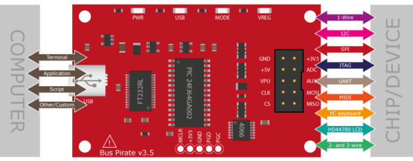
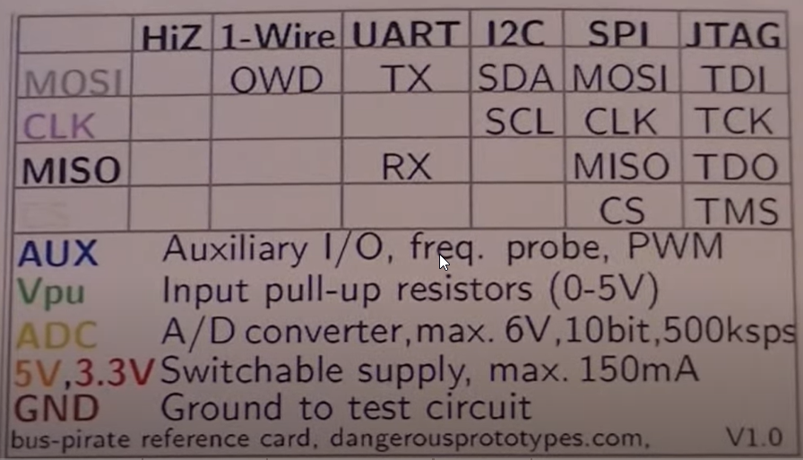
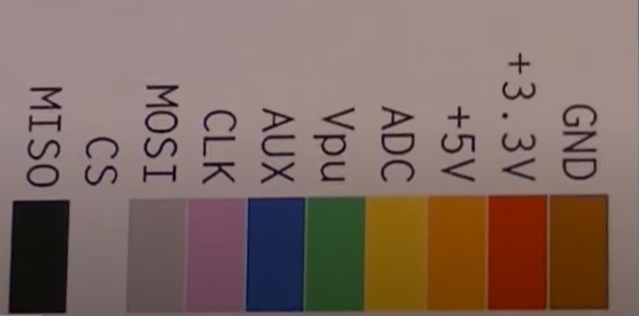

# Bus Pirate 

The Bus Pirate is a **universal bus interface device** designed for programming, 
debugging, and analyzing microcontrollers and other ICs.

A developer can use a serial terminal to interface with a device, via such 
hardware protocols as SPI, I2C and 1-Wire.

## Features

* 0-5.5volt tolerant pins
* 0-6volt measurement probe
* 1Hz-40MHz frequency measurement
* 1kHz - 4MHz pulse-width modulator, frequency generator
* On-board multi-voltage pull-up resistors
* On-board 3.3volt and 5volt power supplies with software reset
* Macros for common operations
* Bus traffic sniffers (SPI, I2C)
* A bootloader for easy firmware updates
* Transparent USB->serial mode
* 10Hz-1MHz low-speed logic analyzer
* Servo driver
* Can program many AVR microcontrollers
    * Supported by AVRdude
    * Can emulate the AVR STK500 v2 with alternate ST500 Clone firmware
* Programs FPGAs and CPLDs with alternate XSVF firmware
* Scriptable from Perl, Python, etc.
* Translations (currently Spanish and Italian)
* Public domain (Creative Commons Zero) source. Prototype with the Bus Pirate, 
    then use the code in your project however you want.

## Protocols (bus modes)

* 1-Wire
* [UART](http://dangerousprototypes.com/docs/UART)
* [I2C](http://dangerousprototypes.com/docs/I2C) 
* [SPI](http://dangerousprototypes.com/docs/SPI_(binary))
* [JTAG](http://dangerousprototypes.com/docs/JTAG)
* [HD44780 LCD](http://dangerousprototypes.com/docs/HD44780_LCDs)
* MIDI
* PC keyboard
* 2- and 3-wire libraries with bitwise pin control
* Scriptable binary bitbang, 1-Wire, I2C, SPI, and UART modes

# Tutorials 
* [Bus Pirate 101 tutorial](http://dangerousprototypes.com/docs/Bus_Pirate_101_tutorial)
* [Bus Pirate 102 tutorial](http://dangerousprototypes.com/docs/Bus_Pirate_102_tutorial)

## References
* [Bus Pirate](http://dangerousprototypes.com/docs/Bus_Pirate)
* [Hardware overview](http://dangerousprototypes.com/docs/Hardware_overview)
* [YouTube: Using Bus Pirate to program I2C RTC](https://youtu.be/eWoG4V59R0M?si=RWo948RS2Amc1kdM)

*Egon Teiniker, 2023, GPL v3.0* 