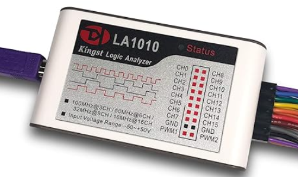

# Logic Analyzer 

Logic analyzer is the instrument that **collects and displays the digital signal 
from the system under test**. It is mainly used for timing judgement an analysis. 

Unlike the oscilloscope with many voltage grades, It has only two grades(Logic “1” and Logic “0”). 
After the reference voltage is set, the logic analyzer could decide from the test signal that the signal 
above the reference voltage is logic 1, and the signal below is logic 0. The digital waveform is formed 
with 1 and 0. Compared with the oscilloscope, when testing and measuring the digital systems like MCU, 
ARM, FPGA and DSP, the logic analyzer could provide better accuracy, much more data and more complicated 
measuring methods.

## References
* [KingstVIS Virtual Instruments Studio](https://www.qdkingst.com/en/download)
* [YouTube: Instrument Basics: Logic Analyzer - Workbench Wednesdays](https://youtu.be/u1DYs2I-_lU?si=hGSFQSv9yEkQS64q)

*Egon Teiniker, 2023, GPL v3.0* 