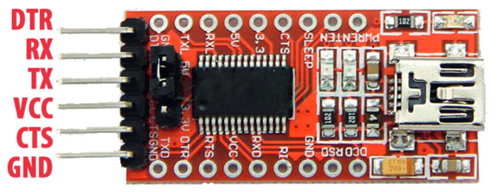

# USB-TTL-Serial-Adapter

The USB-TTL-Serial adapter is used to connect a device with a serial 
interface (UART) to a USB interface, for example to your PC.

* Enables a UART data connection between a PC and other hardware that 
    does not have its own USB converter.

* Depending on your needs, the adapter can be set to a 3.3V or a 5V 
    logic level.

* The logic level can be adjusted using the jumper on the board.

## References
* [YouTube: FTDI FT232RL USB to Serial Module (AZ-Delivery) Detailed Review](https://youtu.be/27zx9MMKbAE?si=5xFWigmY94LVumYs)

* [YouTube: FTDI USB to Serial Adapter Demo](https://youtu.be/7yhgYJe2ShM?si=NMPeUxlEt2oTpLrQ)

*Egon Teiniker, 2023, GPL v3.0* 