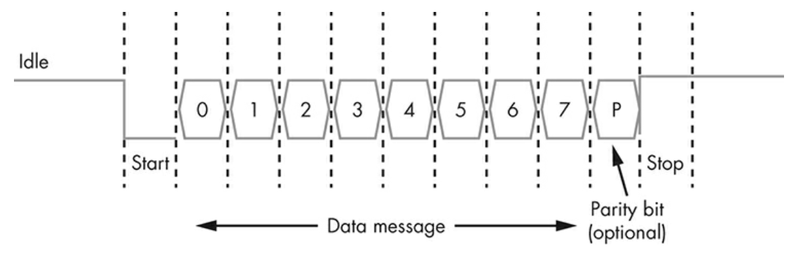

# Universal Asynchronous Receiver-Transmitter (UART)

A UART is a hardware feature that handles communication (i.e., timing requirements 
and data framing) using widely-adopted asynchronous serial communication interfaces, 
such as RS232, RS422, and RS485. 

A UART provides a widely adopted and cheap method to realize full-duplex or
half-duplex data exchange among different devices.

**Vendors typically use UART for debugging**.
It is common for attackers to identify the UART pins on a device’s printed circuit board (PCB) 
using a multimeter or logic analyzer. 
A UART pinout has four ports: **TX (Transmit)**, **RX (Receive)**, **Vcc (Voltage)**, 
and **GND (Ground)**.

## Protocol 

UART is a **serial protocol**, which means it transfers data between components 
**one bit at a time**.
To synchronize communications, the UART transmitter and receiver must agree on a 
specific **baud rate** (the rate of bits transmitted per second).

Generally, the line is held high (at a logical 1 value) while UART is in the idle state. 
Then, to signal the start of a data transfer, the transmitter sends a start bit to the receiver, 
during which the signal is held low (at a logical 0 value). 
Next, the transmitter sends five to eight data bits containing the actual message, followed by an
optional parity bit and one or two stop bits (with a logical 1 value), depending on the configuration. 
The parity bit, used for error checking, is rarely seen in practice. 
The stop bit (or bits) signify the end of transmission.
We call the most common configuration 8N1: eight data bits, no parity, and one stop bit.
The most common baud rates are 9600, 38400, 19200, 57600, and 115200.

## Hardware Tools 
You can use a variety of hardware tools to communicate with UART. 

* One easy option is a [USB-to-serial adapter](../tools/USB-TTL-Adapter/), adapters with the CP2102 or PL2303 chips.

* We can also use the [Bus Pirate](../tools/BusPirate/) board.

## References
* [YouTube: Intro to hardware security: UART access and SPI firmware extraction](https://youtu.be/YD6ODeER8qM?si=jBB6Rreu9XQltQD_)

*Egon Teiniker, 2023, GPL v3.0* 