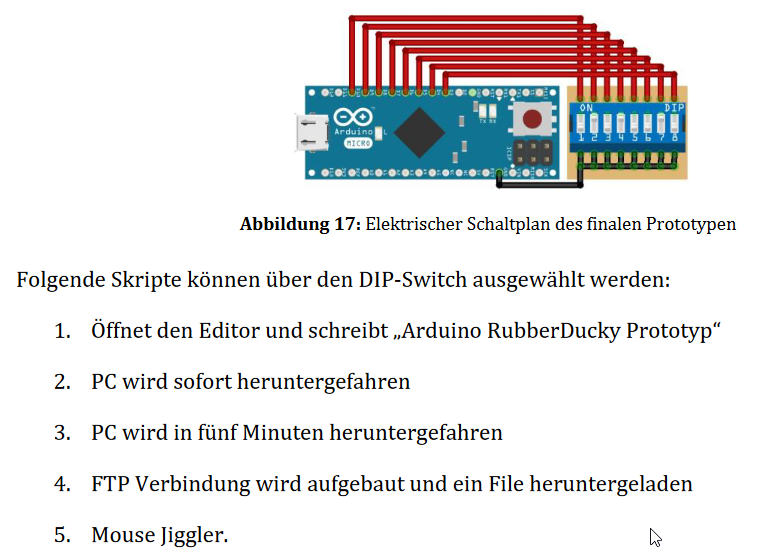

# Universal Serial Bus (USB)

USB was designed to standardize the connection of **peripherals to personal computers**, 
both to exchange data with and to supply electric power.

## Rubber Ducky

To the human eye, the USB Rubber Ducky looks like an unremarkable **USB flash drive**. 

Plug it into a computer, though, and **the machine sees it as a USB keyboard** 
which means it accepts keystroke commands from the device just as if a person was typing them in.

**Johannes Schilling** implemented this Rubber Ducky prototype as part of his bachelor's 
thesis.
The source code can be found in a [GitHub prepository](https://github.com/johannes-schilling/RubberDuckyTestinvironment).

## References

* [Rubber Ducky Testinvironment](https://github.com/johannes-schilling/RubberDuckyTestinvironment)

* [YouTube: How to use the USB Rubber Ducky](https://youtu.be/o1RbXtx0r4U?si=vj085boT9SWLD4dY)

* [The new USB Rubber Ducky is more dangerous than ever](https://www.theverge.com/23308394/usb-rubber-ducky-review-hack5-defcon-duckyscript)

*Egon Teiniker, 2023, GPL v3.0* 