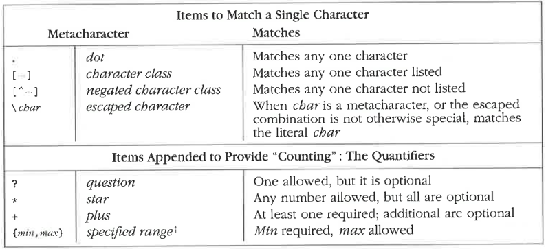
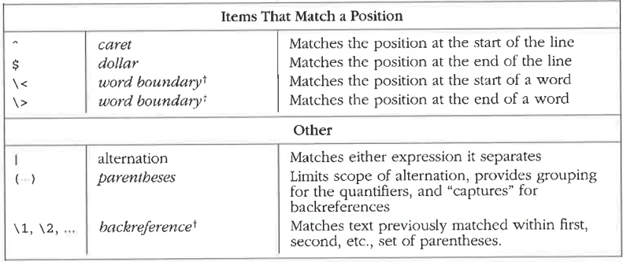

# Input Validation 

**Unchecked input is the source of some of the worst vulnerabilities 
around, including buffer overflow and SQL injection.**

* **Validate all input**. 
    Validate every piece of input the program uses. 
* **Validate input from all sources**.
    Including command-line parameters, configuration files, 
    database queries, environment variables, network services, 
    registry values, system properties, temporary files, and 
    any other source outside your program.
* **Establish trust boundaries**.
    Store trusted and untrusted data separately to ensure that 
    input validation is always performed.

There are different variants of the input validation:

* **Indirect Selection**: Create a list of legitimate values that a 
    user is allowed to specify, and allow the user to supply only the 
    index into that list. The application logic never directly uses 
    input the user provides. This form of input validation is ideal for situations in which a user is selecting from among a list of choices.

* **Whitelisting**: Create a whitelist of acceptable input values. 
    Valid input is then made up exclusively of selections from the set. 
    All other values will be rejected.

* **Blacklisting**: Selectively reject potentially dangerous input values 
    or sequences. Because the set of bad values in a given context is 
    often hard to enumerate (or even infinite), blacklists often turn out 
    to be incomplete. 

**Reject Bad Data!**
* Don’t repair data that fail input validation checks – instead, reject the input.
* Don’t convert one kind of bad input into another for the attacker. 
* Reject input that fails validation outright.

**Make Good Input Validation the Default!**
* Instead of coding up a new solution to the input validation problem 
    every time, arrange your program so that there is a clear, consistent, 
    and obvious place for input validation.
* Make good input validation the default by creating a layer of methods 
    that replace the build-in ones (security-enhanced API).
* We can use the Proxy Design Pattern to add input validation to an 
    existing API. 

## Regular Expressions

Regular expressions (regex) are the key to powerful, flexible, and efficient text processing. Regex are a general notation, which can be used to describe and parse text. 

**A regular expression defines a set of strings**. 
Using regex, we can verify if a given string is an element of that set or not.

Regex are implemented by finite automata. Any regular expression can be converted into a finite automation that recognizes the language it describes, and vice versa.   

## References

* Jeffrey E. F. Friedl. **Mastering Regular Expressions**. O’REILLY, 3rd Edition, 2006

*Egon Teiniker, 2023, GPL v3.0* 